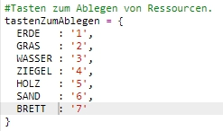
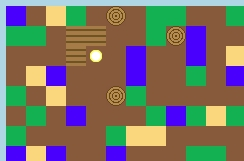

## Bretter aus Holz herstellen

Lass uns eine neue Ressource Brett erstellen, die aus Holz gefertigt wird.

+ Füge zuerst eine neue Variable `BRETT` zu deinem Spiel hinzu.
    
    

+ Füge hier den neuen Namen `BRETT` hinzu.
    
    

+ Gib dieser Ressource den Namen `'Brett'`.
    
    

+ Weise der Ressource `BRETT` ein Bild zu. Das Projekt enthält bereits das `plank.gif`-Bild, aber du kannst dein eigenes erstellen, wenn du das willst.
    
    

+ Füge Bretter zu deinem Inventar hinzu.
    
    

+ Bestimme eine Taste für das Platzieren der Bretter.
    
    

+ Da diese Ressource hergestellt werden kann, musst du eine Regel für die Herstellung programmieren, d. h. ein Brett kann aus 3 Elementen Holz hergestellt werden. Füge diesen Code zu deinem `herstellenMit` -Dictionary hinzu.
    
    

+ Schließlich musst du eine Taste für die Herstellung neuer Bretter festlegen.
    
    

+ Um deine neue Brett-Ressource zu testen, sammle ein paar Elemente Holz ein und stelle dann einige Bretter aus diesem Holz her. Du kannst dann diese neuen Bretter in deiner Welt platzieren.
    
    