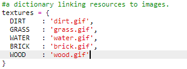
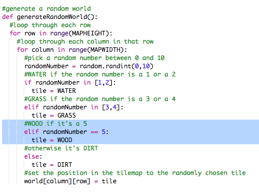

## 新しい木のリソースを作成

新しい木のリソース（WOOD）を作りましょう。 そのために、`variables.py` ファイルにいくつかの変数を追加します。

+ 最初に、新しいリソースに番号を振る 。 そして、単語 `WOOD` を4として使う。
    
    

+ 新しいリソース`WOOD` を`resources`リストに追加。
    
    

+ リソースにはインベントリに表示される名前を付ける必要があります。
    
    
    
    リストに新しいアイテムを追加する際、”`,`”を追加するのを忘れないように。

+ 新しいリソースには画像が必要。 このプロジェクトはすでに`wood.gif`という画像が含まれています。それを`textures` に追加してください。
    
    

+ `Inventory` のWOOD リソースに初期値を設定。
    
    

+ 最後に、木をワールドに配置するための数字をplacekeysに追加。
    
    

+ プロジェクトを実行し、テスト。 木のリソース（WOOD）が持ち物リストにあることを確認。
    
    

+ ワールドに木がない！ `main.py`ファイルを開き、関数`generateRandomWorld()`を修正します。
    
    
    
    このコードは0から10の乱数を生成し、その番号によりどのリソースをはいちするかけっていします。
    
    + 1 か 2 = 水
    + 3 か 4 = 草
    + それ以外 = 土

+ コードを追加し、`randomNumber` が 5だったら木を追加するようにする。
    
    

+ プロジェクトをテストする。 今回はワールドに木があるはずです。
    
    