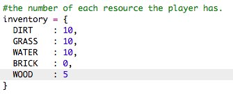
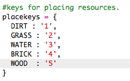

## Створення нового лісового ресурсу

Створимо новий деревний ресурс. Для цього вам потрібно буде додати до деяких змінних у вашому `variables.py` файлі.

+ По-перше, вам потрібно дати вашому новому ресурсу номер. Тоді ви зможете скористатися словом `WOOD` у своєму коді, а не за номером 4.
    
    

+ Ви повинні додати свій новий `WOOD` ресурс до свого списку `ресурсів`.
    
    

+ Ви також маєте надати своєму ресурсу ім'я, яке відображатиметься в інвентарі.
    
    
    
    Зверніть увагу на коментар `,` в кінці рядка вище.

+ Вашому ресурсу також буде потрібно зображення. The project already includes an image called `wood.gif`, which you should add to the `textures` dictionary.
    
    

+ Додайте номер свого ресурсу, який має бути в вашому `інвентарі` , щоб розпочати.
    
    

+ Нарешті, додати ключ, який ви натискаєте, щоб розмістити деревину у світі.
    
    

+ Запустіть свій проект, щоб перевірити його. Ви побачите, що у вашому інвентарі тепер є новий ресурс "деревини".
    
    

+ В світі немає деревини! Щоб виправити це, клацніть на своєму `main.py` файлі та знайдіть функцію `generateRandomWorld ()`.
    
    
    
    Цей код генерує випадкове число від 0 до 10 і використовує номер, щоб вирішити, який ресурс розмістити:
    
    + 1 або 2 = вода
    + 3 або 4 = трава
    + все інше = DIRT

+ Додайте цей код, щоб додати дерево до вашого світу, коли `randomNumber` становить 5.
    
    

+ Перевірте свій проект знову. Цього разу ви повинні побачити, як у вашому світі з'являється дерево.
    
    