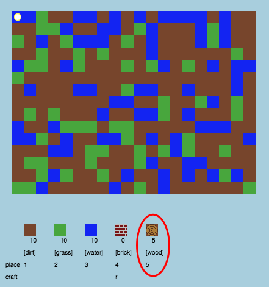

## Створення нового дерев'яного ресурсу

Давай створимо новий деревний ресурс. Для цього тобі потрібно буде додати до деяких змінних у твоєму `variables.py` файлі.

+ По-перше, потрібно дати твоєму новому ресурсу номер. Тоді ти зможеш використати слово `WOOD` у своєму коді, замість цифри 4.
    
    

+ Ти повинен додати свій новий `WOOD` ресурс до свого списку `ресурси`.
    
    

+ Також надай своєму ресурсу ім'я, яке зображуватитметься в інвентарі.
    
    
    
    Зверни увагу на кому `,` в кінці рядка вище.

+ Твоєму ресурсу також потрібно буде зображення. Проект вже містить зображення, яке називається `wood.gif`, яке потрібно додати до `textures` словника.
    
    

+ Для початку додай номер свого ресурсу, який буде у твоєму `inventory`.
    
    

+ Нарешті, додай кнопку для розміщення деревини у світі.
    
    

+ Запусти свій проект, щоб перевірити його. Ти побачиш, що у твоєму інвентарі тепер є новий ресурс "деревина".
    
    

+ У твоєму світі немає деревини! Щоб виправити це, клацни на своєму `main.py` файлі та знайди функцію, що називається `generateRandomWorld()`.
    
    
    
    Цей код генерує випадкове число від 0 до 10 і використовує його, щоб вирішити, який ресурс розмістити:
    
    + 1 або 2 = вода
    + 3 або 4 = трава
    + все інше = земля

+ Додай цей код, щоб додати дерево до твого світу, коли `randomNumber` буде 5.
    
    

+ Перевір свій проект знову. Цього разу ти повинен побачити, як у твоєму світі з'являються дерева.
    
    